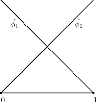

# fem_1d_poisson
Basic Matlab example of solving the 1 dimensional poisson equation with FEM (=Finite element method)

## Introduction
Tutorial to get a basic understanding about implementing FEM using MATLAB. In this example we want to solve the poisson
equation with homogeneous boundary values.

### Get sources
     git clone https://github.com/erikauer/fem_1d_poisson.git

### Run FEM Method in Matlab
Just go inside the project root directory and run the main.m script by enter

     main
 
in Matlab Command Window.

### Change User input
You can change some values as the Interval, the step size of the FEM and modify the RHS of the equation.

To modify the Interval or the step size just go in the top of main.m script to change the values x1, x2 to change
the left or right boundary of the interval. To change the step size just modify the value for h. Here is an short
example of an possible setup:

     x1 = -2;
     x2 = 2;
     h = 1./16;

Another possibility to play around with this FEM method is to change the RHS of the equation. The RHS is defined in the
f.m script. If you open it you can return some other function. Just take attention that the function has to work for 
arrays. So use operations like .* instead of *. Here is an short example:

     y = x.^3;

## Mathematical Context
To understand whats going on in this Matlab example we need do do some math. Here you get a short mathematical
introduction how to prepare the poission equation for FEM.

### Mathematical Problem
We want to solve following mathematical problem - 1 dimensional poisson equation with homogeneous dirichlet boundary condition:

Before we start the implementation we need to do some math ;). We need to derive a weak formulation of the equation above.
So lets start ...

### Weak formulation
In each case if you want to do FEM you have to derive the weak formulation. We choose our shape functions out of the 
Sobolev Space . Multiplying the shape function to the Poisson equation 
above and integrating over the interval lead us to

After integration by parts we get 

In the previous equation we used that the boundary integral is zero because of the choice of the shape function. 
To summarize our result we get the weak form of the poisson equation with dirichlet boundary condition:

Find  that

for all .

###  Discretization and FEM

The idea of FEM is to replace the continuous space  with a finite dimensional 
linear space . So this leads to the discrete weak formulation:

Find  that

for all .

In fact, because  is a linear space, you can find a basis .
This allows us to write each element in  as a linear combination. Using this we can write

and

with . Inserting these both equations into the discrete weak formulation and using the linearity of a and F we get 
following result:

Let us define  to write the equation above in vector form. We obtain

which is equal to the linear System

.

### FEM Calculation and numerical Implementation

As we saw in the previous section it is possible to reduce the problem to solve a linear system of equations. But there are some simplifications
you can do, to make your life easier. The first thing you can do in FEM calculations is to choose the basis 
in a way that the most entries of the matrix of the linear system are zero. You can easily achieve this by taking functions with a reasonable small support. In the simplest case you can choose so called
hat functions.

Let us show a small example to make this important fact clear. We will consider our mathematical problem
above for the interval . On this interval we define the mesh  with
 and .
Each element is defined as . The hat functions are piecewise linear functions with the property 
. Now we have the enough notation to write the bilinear form as

As you see above we can calculate the bilinear form by calculating the integrals for each single element. A lot of these integrals
are zero because of the small support of the hat functions. In the practical implementation it is very useful if you don't have to define
each single hat function. For this reason we define a reference element for the interval  and
transform the integrals into the reference element. First we consider the corresponding transformation. For any element we can define the transformation

that transform each value from the reference element into a value of the physical element. The first derivation of the transformation is

.

Let be  the left hat function of the reference element and 
 the right hat function of the reference element. The following sketch shows the reference
element together with its shape functions.

With the transformation function we obtain the relation

and therefore

for any element .

Finally we can transform each integral of any physical element to the reference element. For the bilinear form we obtain

and analogue we obtain the integral for the RHS

This allows us to just implement the two shape functions for the reference element and just consider each integral on the reference element.
